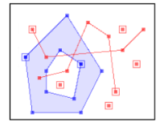
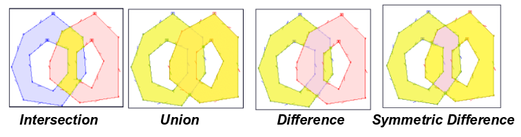

## Vector Geospatial Data

"Vector" is a term commonly used in Geographical Information Systems (GIS) to refer to **discrete geometric entities** (*also referred to as objects, primitives, shapes or features*) that represent or approximate distinct "things" on the land surface (or the bottom of the sea, or Mars); these entity or object types typically are *not used to represent continuously varying fields, rasters or other tessellations*. Examples include points and polygons.

If you're coming from the Earth Sciences, be warned that we're *not referring to fields of arrows* indicating direction and magnitude (for example, for wind velocity).

## Simple Features

The [Open Geospatial Consortium (OGC)](http://www.opengeospatial.org) has defined and standardized a set of geometric objects (plus functions and operators) that are widely adopted in open source and commercial geospatial software. These [**Simple Features (SF)**](https://en.wikipedia.org/wiki/Simple_Features) represent two-dimensional planar geometric objects, as well as other more complex types we won't address here.

We'll focus on the most basic and common types. These are made up of three basic single-entity geometric types and their associated homogeneous collections of multiple entities:

* Single entity:
  * Point
  * Line (*formally known as a LineString*)
  * Polygon
* Homogeneous entity collections:
  * Multi-Point
  * Multi-Line (*MultiLineString*)
  * Multi-Polygon

These are illustrated below, though in a messy presentation:

It's worth noting the existence of another type: a "Geometry Colection", or heterogeneous grab bag of any of the above types. This can be handy, but also confusing and error-prone. We'll try to avoid it in this tutorial and try to stick to sets of homogeneous entity types

Following OGC SF lingo, a **feature** refers to a spatial entity (any of the above) and **encompasses both its geometry and its associated attributes** (eg, name, categories, value of some property like population density). A **feature collection** is then a list or collection of features. Most real-world GIS vector datasets are feature collections. This terminology is widely reflected in Python geospatial software.

Also worth noting is that Simple Features also defines optional "Z" elevation values (often referred to as "2.5 dimension" rather than 3 dimension) and "M" measures (typically a distance along a line or trajectory, such as along a road or river). Software support for Z and M has been spotty, but it's improving. We won't discuss them in this tutorial.

> ## Terminology hell
> Ok, so a `feature collection` made up of Multi-Point features is a collection of collections. Gag. You can read the OGC reports to get the terminology completely self-consistent.
{: .callout}

## Geospatial Operations

A number of relationships and operations ("predicates") have been defined on individual geometric objects or across objects. These include `buffer`, `dissolve`, `convex hull`, `touch`, `intersection`, `union`, `touches`, `within`, `contains`, and others. The execution of these operations is at the heart of vector GIS. We won't cover them in any comprehensive way, but will only present examples to illustrate the capabilities of the Python [GeoPandas](http://geopandas.org/) package and other vector tools. Details on these can be found [here](https://shapely.readthedocs.io/en/stable/manual.html#predicates-and-relationships) and [here](https://en.wikipedia.org/wiki/DE-9IM). Here are a few visual examples (grabbed from [here](https://web.archive.org/web/20160928234929/http://tsusiatsoftware.net/jts/files/JTS_Library_for_Geometry_2011.pdf)) of "overlay" (across objects) geospatial operations:

## Projections

In addition, the Earth is not flat, nor a sphere, not even a perfect ellipsoid. While latitude and longitude can accurately represent a location on the Earth surface, performing area and distance calculations on an ellipsoid (or spheroid) can be pretty challenging. For this reason, instead of working on this **unprojected** or **geodetic** [Coordinate Reference System (**CRS**)](https://en.wikipedia.org/wiki/Spatial_reference_system), one often transforms spatial objects and coordinates into a **projected** CRS (projecting the curved surface into a cartesian plane), particularly when working at scales that are not global (continental, regional, or highly local). Many types of [**projections**](https://en.wikipedia.org/wiki/Map_projection) exist, striving to accurately represent area, distance, orientation, or some combination of the three; most are tuned to be most accurate within a specific area of the Earth.

It's critical to know what projection a dataset is in, and to be able to transform between projections as needed to align datasets. **Projections are covered in more detail in the [Visualization Tutorial](https://geohackweek.github.io/visualization/03-projections/).**
