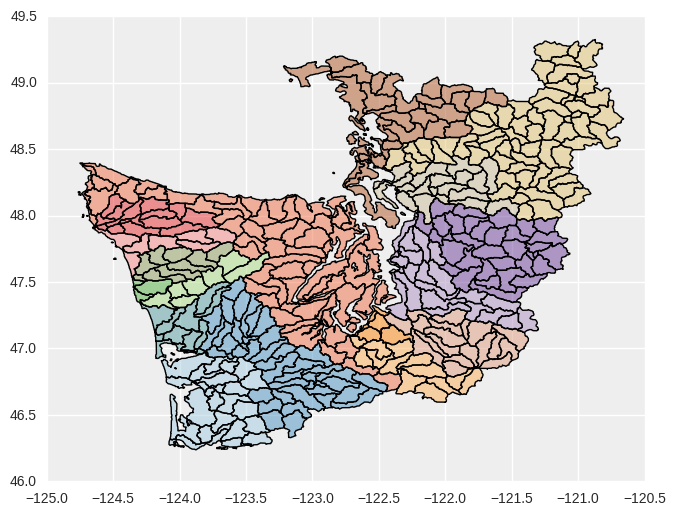
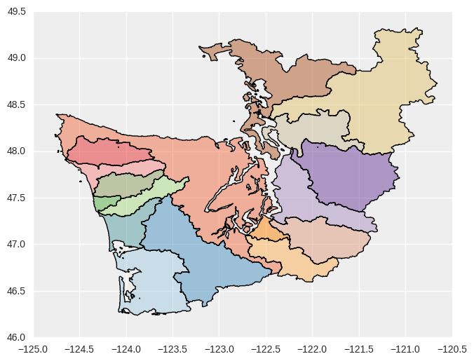
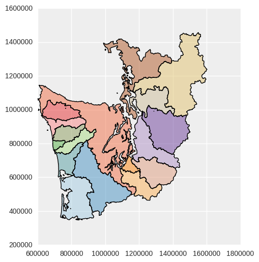
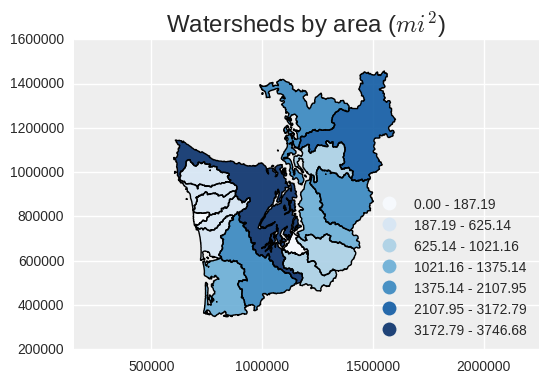
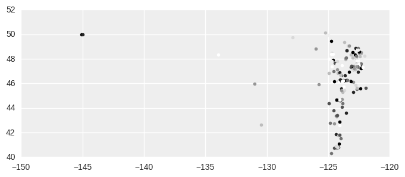
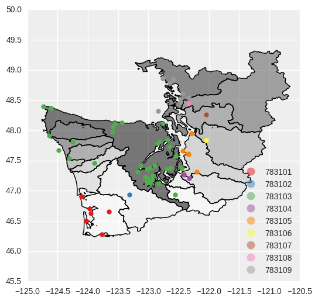
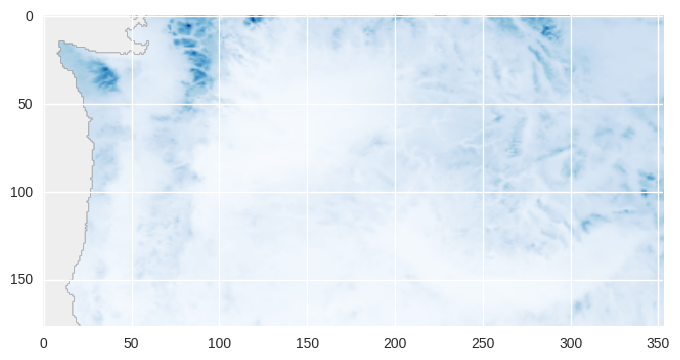
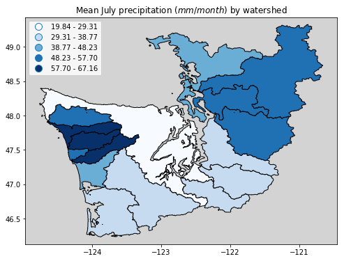

## View episode content in a Jupyter Notebook

[Open the Jupyter Notebook in nbviewer](http://nbviewer.jupyter.org/github/geohackweek/vector/blob/gh-pages/docker/notebooks/geopandas_advanced.ipynb)


## GeoPandas: Advanced topics

## 1. Introduction

We covered the basics of GeoPandas in the previous episode and notebook. Here, we'll extend that introduction to illustrate additional aspects of GeoPandas and its interactions with other Python libraries, covering fancier mapping, analysis (unitary and binary spatial operators), raster zonal stats and geopandas. 

**Here are the main sections in this episode / notebook:**
* Read HydroBASINS North America / Western Washington from PostGIS. *Introduces and reads the watershed dataset that will be used throughout the tutorial, including additional capabilities when reading from PostGIS databases.*
* Dissolve into larger watersheds, and reproject
* Plot `choropleth` map based on calculated watershed areas
* Choropleth map as an interactive map with folium
* Spatial join, `sjoin`, of polygons on points
* rasterstats: "zonal" statistics from polygons on rasters

## 2. Set up packages, data file path, PostgreSQL connectivity
We'll use these throughout the rest of the tutorial.


```python
%matplotlib inline

import os
import json
import psycopg2

import matplotlib.pyplot as plt
# The two statemens below are used mainly to set up a plotting
# default style that's better than the default from matplotlib
import seaborn as sns
plt.style.use('bmh')

from shapely.geometry import Point
import pandas as pd
import geopandas as gpd
from geopandas import GeoSeries, GeoDataFrame

data_pth = "../data"
```

```python
with open(os.path.join(data_pth, ".db.json")) as f:
    db_conn_dict = json.load(f)
```

## 3. Read HydroBASINS North America / Western Washington from PostGIS
Read [HydroBASINS](http://hydrosheds.org/page/hydrobasins) "all-levels" (lev00) hierarchical watersheds dataset for North America from Amazon Cloud PostgreSQL/PostGIS database. **Watersheds in the dataset are at the finest (highest resolution) "Pfastetter" hierarchical level, level 12.**

`from_postgis` is called as before, except now we'll apply a SQL filter to the PostGIS dataset to select only the Pfastetter level-4 watershed with code 7831: `WHERE pfaf_4 = 7831`. This is **most of Western Washington.** Watershed polygons will still be read at their original level 12 resolution.


```python
conn = psycopg2.connect(**db_conn_dict)
```


```python
hydrobas_ww = GeoDataFrame.from_postgis(
    "SELECT * FROM hybas_na_lev00_v1c WHERE pfaf_4 = 7831", 
    conn, geom_col='geometry', crs={'init': u'epsg:4326'}, 
    coerce_float=False)
```


```python
conn.close()
```


```python
len(hydrobas_ww)
```

    413

413 polygon features returned. Let's examine the attributes for the first feature.


```python
hydrobas_ww.iloc[0]
```

    gid                                                      20038
    hybas_id                                           7.00002e+09
    next_down                                                    0
    next_sink                                          7.00002e+09
    main_bas                                           7.00002e+09
    dist_sink                                                    0
    dist_main                                                    0
    sub_area                                                  25.4
    up_area                                                   25.4
    endo                                                         0
    coast                                                        1
    order                                                        0
    sort                                                     20038
    pfaf_1                                                       7
    pfaf_2                                                      78
    pfaf_3                                                     783
    pfaf_4                                                    7831
    pfaf_5                                                   78310
    pfaf_6                                                  783103
    pfaf_7                                                 7831033
    pfaf_8                                                78310330
    pfaf_9                                               783103300
    pfaf_10                                            7.83103e+09
    pfaf_11                                            7.83103e+10
    pfaf_12                                            7.83103e+11
    geometry     (POLYGON ((-124.3416666666666 47.4583333333333...
    Name: 0, dtype: object


**Plot a categorical map, with coloring based on the aggregating column `pfaf_7`.** Watershed boundaries are at the high-resolution Pfastetter level 12.


```python
hydrobas_ww.plot(column='pfaf_7', cmap='Paired', categorical=True, figsize=(14,6));
```




## 4. Dissolve into larger watersheds, and reproject

### Dissolve source polygons into larger watersheds based on attribute values
Apply GeoDataFrame [dissolve](http://geopandas.org/aggregation_with_dissolve.html) aggregation method (implemented from lower level `shapely` operators) on level-7 Pfastetter codes (`pfaf_7`) shown in the plot above. Aggregate attributes, retaining only `pfaf_7` and `pfaf_6` (plus `geometry`, of course). Note that this operation results in only 17 polygons, from the original 413.


```python
cols = ['pfaf_6', 'pfaf_7', 'geometry']
hydrobas_ww_p7 = hydrobas_ww[cols].dissolve(by='pfaf_7', aggfunc='first', as_index=False)
len(hydrobas_ww_p7)
```


    17


```python
hydrobas_ww_p7.crs
```

The CRS was not retained during the dissolve operation. Apply it by copying it from `hydrobas_ww`.


```python
hydrobas_ww_p7.crs = hydrobas_ww.crs
hydrobas_ww_p7.crs
```


    {'init': u'epsg:4326'}


Let's examine some of the features.


```python
hydrobas_ww_p7.head()
```


<br>
<table border="1" class="dataframe">
  <thead>
    <tr style="text-align: right;">
      <th></th>
      <th>pfaf_7</th>
      <th>geometry</th>
      <th>pfaf_6</th>
    </tr>
  </thead>
  <tbody>
    <tr>
      <th>0</th>
      <td>7831010</td>
      <td>(POLYGON ((-123.5722222222222 46.2458333333333...</td>
      <td>783101</td>
    </tr>
    <tr>
      <th>1</th>
      <td>7831020</td>
      <td>POLYGON ((-123.1791666666666 46.33333333333336...</td>
      <td>783102</td>
    </tr>
    <tr>
      <th>2</th>
      <td>7831031</td>
      <td>(POLYGON ((-123.9597222222222 46.9666666666667...</td>
      <td>783103</td>
    </tr>
    <tr>
      <th>3</th>
      <td>7831032</td>
      <td>POLYGON ((-123.8583333333333 47.39583333333336...</td>
      <td>783103</td>
    </tr>
    <tr>
      <th>4</th>
      <td>7831033</td>
      <td>POLYGON ((-124.3 47.34583333333336, -124.30221...</td>
      <td>783103</td>
    </tr>
  </tbody>
</table>
<br>


Plot the results. Looks like the previous plot, except the polygon boundaries are now the pfaf_7 watersheds (same as the background colors).


```python
hydrobas_ww_p7.plot(column='pfaf_7', cmap='Paired', categorical=True, figsize=(14,6));
```





> ## Beware of "invalid" geometries!
> **Beware that `dissolve` may fail if there are "invalid" geometries.**
> See this code from the previous, intro notebook. The 6 geometries/points reported are invalid (and are reported by the `is_valid()` method). This dissolve statement does work, though.
> ~~~
> seas_grp = seas[['oceans', 'geometry']]
> seas_oceans_diss = seas_grp[seas_grp.geometry.is_valid].dissolve(by='oceans')
> 
> Ring Self-intersection at or near point 10.407218181818182 54.821390909090908
> Self-intersection at or near point -79.365827272727287 76.296645454545455
> Ring Self-intersection at or near point 10.979445510225332 54.380555030408686
> Ring Self-intersection at or near point 133.61550925464189 -4.3005540903175188
> Ring Self-intersection at or near point 121.91067196634913 -5.0593090510592447
> Ring Self-intersection at or near point 115.29553592754269 -7.0082630551828515
> ~~~
> {: .python}
{: .callout}

### Reproject (transform) to WA State Plane South, epsg:2927
Partly so we can calculate polygon areas in linear units, not geodetic degrees. But also because that's the projection used by most state and local governments in Washington.
* [http://epsg.io/?q=2927](http://epsg.io/?q=2927)
* [http://spatialreference.org/ref/epsg/2927/](http://spatialreference.org/ref/epsg/2927/)
* [Report from http://www.epsg-registry.org](http://www.epsg-registry.org/report.htm?type=selection&entity=urn:ogc:def:crs:EPSG::2927&reportDetail=short&style=urn:uuid:report-style:default-with-code&style_name=OGP%20Default%20With%20Code&title=EPSG:2927)

No need to go to a web site to learn more about what `epsg:2927` is. Use `pyepsg`, which issues queries to http://epsg.io web services.


```python
import pyepsg
```

Extract the epsg code from the string returned by `crs['init']`.


```python
hydrobas_ww_p7_epsg_str = hydrobas_ww_p7.crs['init'].split(':')[1]
pyepsg.get(hydrobas_ww_p7_epsg_str)
```


    <GeodeticCRS: 4326, WGS 84>


Query epsg `2927`.


```python
pyepsg.get('2927')
```


    <ProjectedCRS: 2927, NAD83(HARN) / Washington South (ftUS)>


**Apply the crs transformation (reprojection)** using `to_crs` method.


```python
hydrobas_ww_p7_wasp = hydrobas_ww_p7.to_crs(epsg=2927)
```

#### Plot the reprojected map.
Note that, being in a planar project (not geodetic), the shape looks different compared to the previous map. More "normal". And the axes are now in `feet` relative to some origin.


```python
hydrobas_ww_p7_wasp.plot(column='pfaf_7', cmap='Paired', categorical=True, figsize=(14,6));
```





## 5. Plot `choropleth` map based on calculated watershed areas
As the projection is in `feet`, auto-calculated polygon areas will be in feet<sup>2</sup>. So let's convert to miles<sup>2</sup> first (why not!). We'll add a new column to the GeoDataFrame.


```python
hydrobas_ww_p7_wasp['area_mi2'] = hydrobas_ww_p7_wasp.geometry.area / 27878400
hydrobas_ww_p7_wasp.head(3)
```


<br>
<table border="1" class="dataframe">
  <thead>
    <tr style="text-align: right;">
      <th></th>
      <th>pfaf_7</th>
      <th>geometry</th>
      <th>pfaf_6</th>
      <th>area_mi2</th>
    </tr>
  </thead>
  <tbody>
    <tr>
      <th>0</th>
      <td>7831010</td>
      <td>(POLYGON ((863343.6925921033 347890.2242189167...</td>
      <td>783101</td>
      <td>1375.137396</td>
    </tr>
    <tr>
      <th>1</th>
      <td>7831020</td>
      <td>POLYGON ((963803.8027083561 376154.9965688475,...</td>
      <td>783102</td>
      <td>2107.945774</td>
    </tr>
    <tr>
      <th>2</th>
      <td>7831031</td>
      <td>(POLYGON ((776917.1877152125 614568.383332147,...</td>
      <td>783103</td>
      <td>528.472846</td>
    </tr>
  </tbody>
</table>
<br>


> ## Pandas `groupby` aggregation
> Now you could get the area of a pfaf_6 watershed via simple Pandas DataFrame `groupby` aggregation (sum).
{: .callout}

Plot the choloropleth, using `area_mi2`.

"fisher_jenks" value segmentation `scheme` (using 7 segments, k=7) used is one of the available `pysal.esda.mapclassify.Map_Classifier` classifiers from the powerful [PySAL package](http://pysal.github.io) (Python Spatial Analysis Library); GeoPandas can use these classifiers if PySAL is installed. To get the list of classifiers, use:
```python
import pysal
print(pysal.esda.mapclassify.Map_Classifier.__doc__)
```


```python
f, ax = plt.subplots(1, figsize=(6, 4))
hydrobas_ww_p7_wasp.plot(column='area_mi2', scheme='fisher_jenks', k=7, 
                         alpha=0.9, cmap=plt.cm.Blues, legend=True, ax=ax)
plt.axis('equal')
ax.set_title('Watersheds by area ($mi^2$)');
```





## 6. Choropleth map as an interactive map with folium
[Folium](https://github.com/python-visualization/folium) is very cool, specially for use in Jupyter notebooks; or to export into stand-alone HTML.


```python
import folium
```

Folium likes GeoJSON for geometries. GeoPandas makes conversion easy.


```python
geo_str = hydrobas_ww_p7.to_json()
```

`m.choropleth` will do an attribute join between `geo_str` and `hydrobas_ww_p7_wasp` based on the key `pfaf_7`.


```python
m = folium.Map(location=[47.8, -122.5], zoom_start=7, 
               tiles="cartodbpositron")

m.choropleth(geo_str=geo_str,
             data=hydrobas_ww_p7_wasp, columns=['pfaf_7', 'area_mi2'],
             key_on='feature.properties.pfaf_7',
             fill_color='YlGn', fill_opacity=0.4,
             legend_name='area')
m
```


This map is interactive, so play with it (zoom and pan) in the notebook. There is a lot more to explore in Folium! This is just a teaser.

## 7. Spatial join, `sjoin`, of polygons on points
We'll use an old, local snapshot of NANOOS coastal and marine monitoring stations in the Pacific NW, from the [NANOOS Visualization System (NVS) Data Explorer](http://nvs.nanoos.org/Explorer). While many stations are moorings on marine waters, some are inshore or in tidal shores and will overlap the watershed boundaries.

The point file is in the [GeoPackage](http://www.geopackage.org) format, an OGC format implemented in SQLite.


```python
nanoosstations_gdf = gpd.read_file(os.path.join(data_pth, "nanoos_nvs.gpkg"))
len(nanoosstations_gdf)
```

    194

```python
nanoosstations_gdf.iloc[-1]
```

    data_source                                                  Decagon
    data_source_url                               http://www.decagon.com
    geometry                                   POINT (-122.6966 47.3612)
    lat                                                          47.3612
    lon                                                         -122.697
    name                                     Henderson Bay site, W shore
    nvs_station_url    http://nvs.nanoos.org/Explorer?action=oiw:fixe...
    platform_label                                     WADOH_HendrsnBay1
    platform_type                                   Fixed Shore Platform
    provider                                                       WADOH
    provider_type                                                  State
    provider_url                                   http://www.doh.wa.gov
    region                                                   Puget Sound
    short_name                                       WADOH Henderson Bay
    state                                                     Washington
    status                                                        online
    status_date                                     2016-06-24T18:00:00Z
    url                http://www.doh.wa.gov/CommunityandEnvironment/...
    Name: 193, dtype: object


Points in the coasts of the Pacific NW (BC, WA, OR) and out in the open ocean.


```python
nanoosstations_gdf.plot(markersize=4);
```




**Apply "inner" spatial join with `sjoin` operator** from the `gpd.tools` package. An inner join will retain only overlapping features. Then plot as a map overlay on top of `hydrobas_ww_p7`, categorizing (coloring) points by the `pfaf_6` watershed they're in.


```python
nanoossta_hydrobas_ww_gdf = gpd.tools.sjoin(nanoosstations_gdf, hydrobas_ww_p7, how="inner")
len(nanoossta_hydrobas_ww_gdf)
``

    63


```python
f, ax = plt.subplots(1, figsize=(6, 6))
plt.axis('equal')
hydrobas_ww_p7.plot(ax=ax)
nanoossta_hydrobas_ww_gdf.plot(column='pfaf_6', markersize=6, 
                               categorical=True, legend=True, ax=ax);
```




## 8. rasterstats: "zonal" statistics from polygons on rasters
We'll end by mixing features from a GeoDataFrame with a raster, applying zonal statistics using the cool and light weight [rasterstats](http://pythonhosted.org/rasterstats/) package.

Monthly Juy long-term climatology precipitation. The original monthly time series data are from the [PRISM Climate Group](http://prism.oregonstate.edu); the monthly climatology and Pacific NW clip were created by your truly and Don Setiawan for the [BiGCZ project](http://bigcz.org).


```python
ppt_july_tif_pth = os.path.join(data_pth, 'prism_precipitation_july_climatology.tif')
```

### rasterio

Rasterstas uses [rasterio](https://mapbox.github.io/rasterio) to read rasters (and `fiona` to read vector datasets), so we'll first do a quick exploration of rasterio.


```python
import rasterio
import rasterio.plot as rioplot
```


```python
ppt_july = rasterio.open(ppt_july_tif_pth)
ppt_july
```

    <open DatasetReader name='../data/prism_precipitation_july_climatology.tif' mode='r'>


Examine the metadata read from the raster file (we can confirm CRS is epsg:4326), then plot the raster. 


```python
ppt_july.meta
```

    {'count': 1,
     'crs': CRS({'init': u'epsg:4326'}),
     'driver': u'GTiff',
     'dtype': 'float32',
     'height': 177,
     'nodata': -9999.0,
     'transform': Affine(0.04, 0.0, -125.12921197411002,
           0.0, -0.04, 49.045740291264174),
     'width': 353}


> ## Plotting issue
> `with_bounds=True` is supposed to display the X & Y coordinate labels (lat & lon) from the metadata. We don't why this isn't working.
{: .callout}


```python
rioplot.show(ppt_july, with_bounds=True, cmap=plt.cm.Blues);
```




### Apply rasterstas `zonal_stats`

Apply `zonal_stats` from `rasterstats` package. Can pass a `GeoDataFrame` directly (instead of the file path to a GIS file) because it implements our old friend, the `__geo_interface__` method. For the raster, we pass its file path.

`zonal_stats` returns a geojson with the original properties plus the zonal statistics.


```python
import rasterstats as rs
```


```python
zonal_ppt_gjson = rs.zonal_stats(hydrobas_ww_p7, ppt_july_tif_pth,
                                 prefix='pptjuly_',
                                 geojson_out=True)
```


```python
len(zonal_ppt_gjson)
```

    17


```python
zonal_ppt_gdf = GeoDataFrame.from_features(zonal_ppt_gjson)
zonal_ppt_gdf.head(2)
```

<br>
<table border="1" class="dataframe">
  <thead>
    <tr style="text-align: right;">
      <th></th>
      <th>geometry</th>
      <th>pfaf_6</th>
      <th>pfaf_7</th>
      <th>pptjuly_count</th>
      <th>pptjuly_max</th>
      <th>pptjuly_mean</th>
      <th>pptjuly_min</th>
    </tr>
  </thead>
  <tbody>
    <tr>
      <th>0</th>
      <td>(POLYGON ((-123.5722222222222 46.2458333333333...</td>
      <td>783101</td>
      <td>7831010</td>
      <td>259</td>
      <td>49.824776</td>
      <td>33.674382</td>
      <td>23.438837</td>
    </tr>
    <tr>
      <th>1</th>
      <td>POLYGON ((-123.1791666666666 46.33333333333336...</td>
      <td>783102</td>
      <td>7831020</td>
      <td>404</td>
      <td>96.738289</td>
      <td>29.443886</td>
      <td>15.356521</td>
    </tr>
  </tbody>
</table>
<br>


#### And finally, a choropleth map of July precipitation by watershed!

```python
f, ax = plt.subplots(1, figsize=(6, 5))
zonal_ppt_gdf.plot(column='pptjuly_mean', scheme='Equal_Interval', k=5, 
                   alpha=1, cmap=plt.cm.Blues, legend=True, ax=ax)
plt.axis('equal')
ax.set_title('Mean July precipitation ($mm/month$) by watershed');
```


